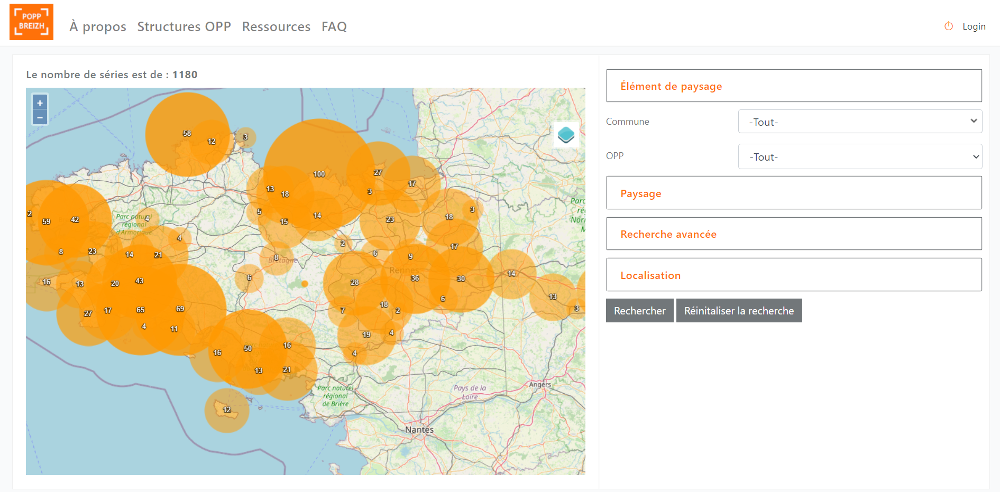

# Documentation technique et charte de bonnes pratiques pour déployer la POPP

*Cette documentation technique a pour objectif de décrire la procédure pour développer une POPP (Plateforme des Observatoires Photographique du Paysage) à l’image de la POPP-Breizh. Elle donne aussi des préconisations et recommandations dans l’optique de pérenniser le logiciel de la POPP grâce à la constitution d’une communauté de POPP.*

*Pour déployer une POPP, veuillez nous contacter au préalable :*    
*Observatoire de l’Environnement en Bretagne / Pôle nature et paysages – Caroline Guittet*    
*caroline.guittet@bretagne-environnement.fr / 02 99 35 84 86*    



## 1. Présentation de la POPP-Breizh
### 1.1 Présentation de la POPP Breizh

*	Lien de la POPP-Breizh : http://popp-breizh.fr
*	Présentation des fonctionnalités de la POPP-Breizh : http://popp-breizh.fr/files//ressource/presentation_popp_breizh_1.pdf? 
*	Cahier des charges des clauses techniques : https://hal.archives-ouvertes.fr/hal-01079835 
*	Charte d’utilisation de la POPP-Breizh : http://popp-breizh.fr/files//faq/Charte%20d'utilisation_POPP%20BREIZH_26_mars_2019_0.pdf

### 1.2 Les prérequis pour déployer une POPP
*	Compétence en informatique : moyenne
  JavaScript ; CSS 

*	Compétence pôle métier : élevée
  Maîtrise de la démarche OPP, bonne connaissance des dynamiques paysagères sur le territoire, bonne connaissance du réseau d’utilisateurs, compétence en formation

*	Temps d’installation estimé : 3 heures
*	Temps de paramétrage estimé : 2 jours

*Une fois la POPP déployée, une personne doit administrer la POPP pour activer les comptes utilisateurs, pour paramétrer les différents contenus selon les besoins des utilisateurs et pour prévenir des éventuels disfonctionnements. Aussi, la POPP doit évoluer à mesure des avancées technologiques pour favoriser sa pérennité.* 

## 2 Procédure d'installation

### 2.1 Procédure technique

__Create application user and run HTTP server__
```shell
$ php bin/console doctrine:schema:create # Create database schema from entity model
$ php bin/console fos:user:create --super-admin # Create first application user with admin privileges
$ php bin/console server:run # Run http server
```

Pour installer les dépendances
```shell
$ yarn install
$ php composer.phar install
```

Pour lancer le serveur en dev
```shell
$ yarn encore dev -w
$ php bin/console server:run
```

Pour le passer en mode prod
Modifier le fichier .env
`APP_ENV=prod`

```shell
$ yarn encore production 
$ php bin/console c:c
$ chown -R www-data:www-data var/cache
```

puis lancer l'application à l'adresse /public/popp

### 2.2 Code source
Le code source de la POPP-Breizh est disponible sur Github : https://github.com/Observatoire-environnement-Bretagne/poppV2

## 3 Paramétrage

### 3.1 Module cartogaphique
*En cours de rédaction*

### 3.2 Paramétrage thématique
* Ensembles de paysage 
* Unités de paysage
* Unités de paysage locales 
* Axes thématiques 
* Thésaurus facultatif
* Typologie de paysage 
* Licence des photographies 

### 3.3 Paramétrage des comptes gestionnaires
1.	Créer les structures OPP
2.	Créer le compte gestionnaire 
3.	Créer le ou les groupes OPP associé(s) 

## 4 Licence libre et recommandations

La POPP est un logiciel libre sous licence GPLv3 qui implique des règles à suivre : https://www.gnu.org/licenses/gpl-3.0.html

### 4.1 Principes de la licence libre 
Chaque utilisateur a : 
* la liberté d’utiliser le logiciel à n’importe quelle fin,
* la liberté de modifier le programme pour répondre à ses besoins,
* la liberté de redistribuer des copies à ses amis et voisins,
* la liberté de partager avec d'autres les modifications qu'il a faites.

### 4.2 Principes de paternité
La POPP a été co-construite par des institutions, merci de citer la paternité de la POPP-Breizh, à savoir : la Région Bretagne, la DREAL Bretagne, le laboratoire ESO-Rennes, l’Observatoire de l’environnement en Bretagne et le réseau des OPP Bretons 

### 4.3 Prescriptions
La licence GPLv3 facilite la coopération avec la communauté du logiciel libre. Les co-auteurs de la POPP-Breizh souhaitent que les développeurs publient sur Github l’ensemble des évolutions réalisées pour améliorer le logiciel POPP. Ce partage bénéficiera à la communauté de la POPP (développeurs et utilisateurs) et permettra des économies de moyens. 
Il est demandé par les co-auteurs de la POPP-Breizh que les autres POPP soient également sus la licence GPLV3.  

## 5 Préconisations pour la communauté des POPP 
### 5.1 Construire un réseau POPP
Si plusieurs POPP se développent en France et à l’international, il serait pertinent de constituer un réseau de POPP. En effet, animer un réseau de l’ensemble des POPP déployés dans les régions permettrait : 
*	de mettre en commun les besoins, 
*	de mutualiser les compétences, 
*	de suivre les évolutions développées potentiellement en partenariat, 
*	de partager les développements informatiques 
*	de partager des préoccupations paysagères er de développer un tronc commun pour un moissonnage des données à l’échelle des POPP.

### 5.2 Conserver un tronc commun pour un moissonnage éventuel des POPP
La POPP-Breizh a comme particularité de renseigner pour chaque série OPP les éléments de paysage (haie agricole, maison individuelle, etc.) qui sont visibles au sein des images et les types de changement qui leur sont associés (augmentation, diminution, etc.).  Il serait intéressant que chaque POPP utilise un tronc commun de requêtes pour qu’à terme les données photographiques puissent être partageables à partir des mêmes filtres via le réseau de POPP. Voici quelques exemples de filtres partageables, et qui sont à enrichir par la communauté : 
*	Typologie de paysage : paysage urbain, périurbain et centre-ville ; paysage littoral et d’îles ; paysage de vallée, paysage rural, naturel et de forêt ; paysage de plaine et de plateau 
*	Même format de date : année 
*	Thésaurus tronc commun composé aujourd’hui de 173 éléments de paysage
*	Sept typologies de changement : stabilité, apparition, disparition, modification, augmentation, diminution, changement d’aspect

*Fonctionnement du thésaurus : http://popp-breizh.fr/files//faq/tutoriel_creer_series_OPP_popp_breizh_2021.pdf (p. 6, 7, 15, 16)*

## 6	Les tutoriels de la POPP-Breizh 
Il existe d’ores et déjà quatre tutoriels qui correspondent aux trois profils d’utilisateurs : 
* Tutoriel administrateur de la POPP-Breizh : *bientôt disponible*
* Tutoriel gestionnaire de la POPP-Breizh (pilotage d’un OPP) : http://popp-breizh.fr/files//faq/tutoriel_gestionnaire_opp_POPP_0.pdf
* Tutoriel fournisseur de la POPP-Breizh (fournisseur d’une ou plusieurs séries OPP) : http://popp-breizh.fr/files//faq/tutoriel_devenir_fournisseur_de_la_POPP_Breizh_0.pdf
* Tutoriel créer une série OPP (ou OPP Pa) dans la POPP-Breizh : http://popp-breizh.fr/files//faq/tutoriel_creer_series_OPP_popp_breizh_2021.pdf 


